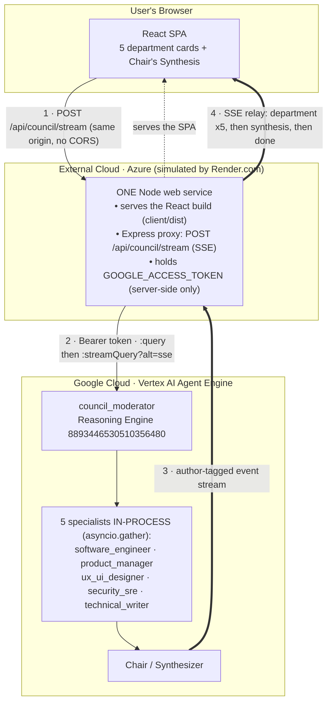
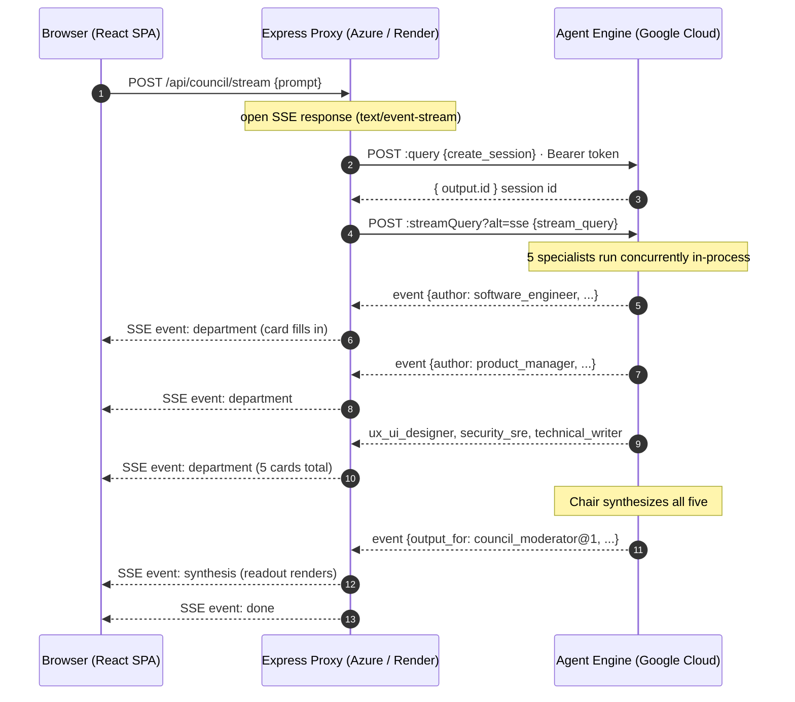
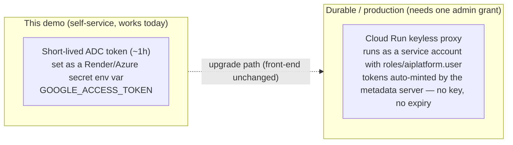

# Architecture — Cross-Cloud Access to the GCP Agent Platform

This app is a **cross-cloud access proof**: a front-end hosted on **one cloud**
reaches a **council_moderator** agent running on the **Google Cloud Agent Platform**
(Vertex AI Agent Engine), and **streams** the five departments' answers live.

> **Render.com here stands in for Azure.** The goal is to prove that a front-end /
> service hosted on a *different* cloud — e.g. **Azure App Service** or **Azure
> Container Apps** — can call the GCP-hosted Agent Engine. Render is used only
> because it spins up a free Node web service in seconds; the architecture, the
> auth model, and the code are identical for Azure. See
> [§ Mapping Render → Azure](#mapping-render--azure).

---

## 1. Component view

**One service, two jobs, same origin:**

1. `express.static('client/dist')` + SPA fallback serves the built React app.
2. `POST /api/council/stream` proxies to the Agent Engine and **relays** its event
   stream to the browser as Server-Sent Events (SSE).

Because the browser only ever talks to **its own origin**, there is **no CORS**
anywhere, and the Google token **never leaves the server**.

---

## 2. Streaming sequence

**Routing rule (verified against the live engine):** an event is the **synthesis**
iff `node_info.output_for` includes `council_moderator@1` (equivalently
`node_info.path === council_moderator@1/main_orchestration_workflow@1`). Every
other event's `author` is one of the five specialist keys — that's how the proxy
tags each `department` SSE event.

---

## 3. Why a backend proxy is mandatory

A React app in the browser **cannot call the Agent Engine directly** — two hard reasons:

| Blocker | Detail | Consequence |
|---|---|---|
| **Auth** | Vertex AI Agent Engine requires a **Google OAuth2 Bearer token** (no anonymous / API-key mode). | A token in client-side JS would be a credential leak. |
| **CORS** | `*-aiplatform.googleapis.com` sends **no CORS headers** for arbitrary browser origins. | The browser blocks a direct cross-origin fetch. |

The proxy solves both: it holds the token server-side and the browser calls the
**same origin**, so CORS never applies.

---

## 4. Auth model

- **Now:** a personal **short-lived (~1 h) ADC token** is injected as a secret env
  var, purely to prove reachability. On a `401`, re-mint the token, `PUT` the env
  var, and redeploy.
- **Durable:** the front-end stays identical; only *where the proxy gets its token*
  changes. The cleanest permanent design is a **Cloud Run keyless proxy** — a
  service account with `roles/aiplatform.user`, tokens auto-minted by Cloud Run's
  metadata server (no key file, no expiry). That needs a one-time admin grant of
  `aiplatform.reasoningEngines.query` to the service account (this project's IAM
  can't self-grant it). A service-account **key file** used with
  `google-auth-library` (auto-refresh) is the alternative if org policy allows keys.

> **The deployed Agent Engine is never touched by any of this** — the proxy only
> *calls* it. The council already streams every department; the proxy just relays
> the stream instead of collapsing it.

---

## 5. SSE contract (proxy → browser)

| SSE `event:` | `data:` payload | When |
|---|---|---|
| `department` | `{ "key", "name", "text" }` | Each time a specialist's text arrives (accumulated). |
| `synthesis` | `{ "text" }` | The Chair's final consolidated readout. |
| `error` | `{ "error", "status" }` | Upstream failure (e.g. `401` token expired). |
| `done` | `{}` | Stream complete. |

The React app reads this with `fetch(...).body.getReader()` + `TextDecoder`
(EventSource can't `POST`), fills the five fixed-order department cards live, then
renders the synthesis.

---

## 6. Mapping Render → Azure

The demo runs on Render, but the architecture is cloud-agnostic on the front-end
side. To run the exact same thing on **Azure**:

| This demo (Render) | Azure equivalent |
|---|---|
| Render free **Web Service** (Node) | **Azure App Service** (Node) or **Azure Container Apps** |
| Render env var (secret) `GOOGLE_ACCESS_TOKEN` | App Service **Application settings** / **Azure Key Vault** reference |
| `https://<name>.onrender.com` | `https://<name>.azurewebsites.net` (or custom domain) |
| Auto-deploy from the GitHub repo | App Service deploy via **GitHub Actions** / Oryx build |
| (optional) split static front-end | **Azure Static Web Apps** + the proxy on App Service |

Nothing in `server.js` or the React app is Render-specific — it binds
`0.0.0.0:$PORT` and reads config from env vars, both of which App Service /
Container Apps provide identically.

---

## 7. Key files

| File | Role |
|---|---|
| `server.js` | Express: static SPA + `POST /api/council/stream` (SSE relay) + `POST /api/council` (non-stream fallback) + `GET /api/health`. |
| `client/src/App.jsx` | React: prompt box, 5 progressive department cards, Chair's Synthesis; consumes the SSE stream. |
| `client/src/styles.css` | Styling for the streaming UI. |
| `e2e/tests/access.spec.js` | Playwright: cold-start-robust mount + streaming assertions. |
| `.env.example` | The four env vars the proxy needs (no secrets committed). |

---

## 8. Notes & limits

- **Free-tier cold start:** Render free services sleep after ~15 min idle; the
  first hit takes ~30–60 s to wake (the SPA bundle request can even abort mid-wake).
  The proxy uses a **200 s** upstream timeout and the Playwright test retries the
  mount. Azure App Service on a paid tier (Always On) removes this.
- **Concurrency:** the five specialists run concurrently (`asyncio.gather`) on the
  agent, so department cards fill in roughly as each finishes (not strictly 1→5);
  the synthesis is always last.
- **Not production:** see [§4](#4-auth-model) — the short-lived personal token is a
  test affordance, not a durable credential.
