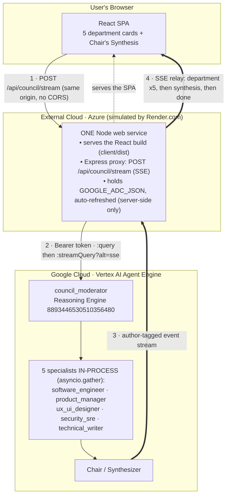
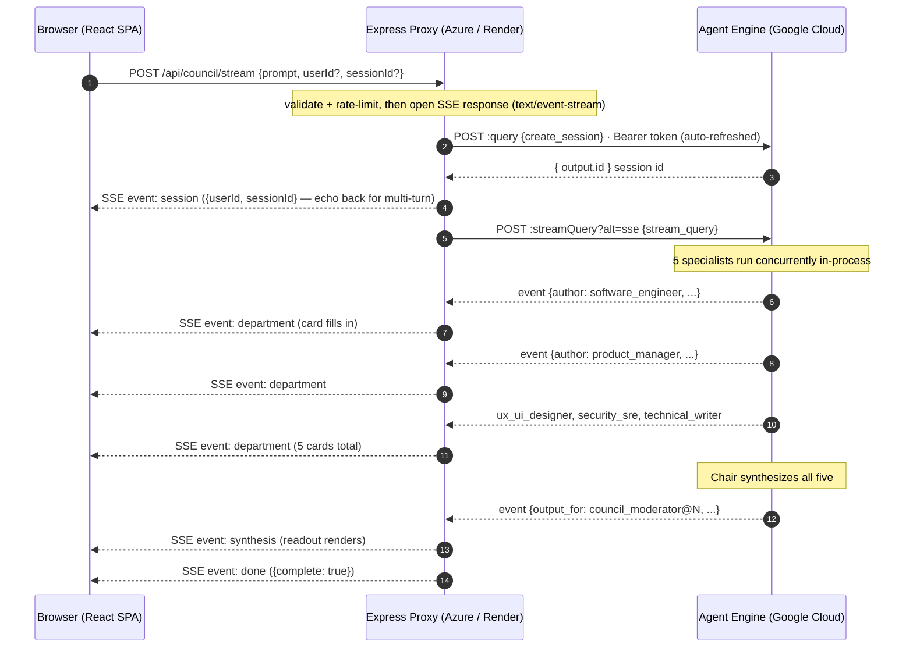
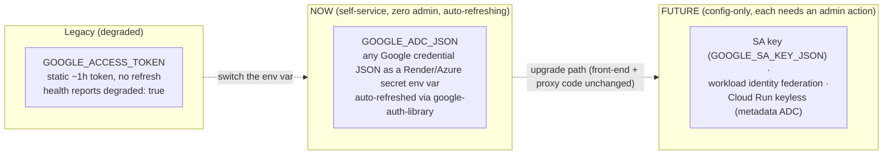

# Architecture — Cross-Cloud Access to the GCP Agent Platform

This app is a **cross-cloud access proof**: a front-end hosted on **one cloud**
reaches a **council_moderator** agent running on the **Google Cloud Agent Platform**
(Vertex AI Agent Engine), and **streams** the five departments' answers live.

> **Render.com here stands in for Azure.** The goal is to prove that a front-end /
> service hosted on a *different* cloud — e.g. **Azure App Service** or **Azure
> Container Apps** — can call the GCP-hosted Agent Engine. Render is used only
> because it spins up a free Node web service in seconds; the architecture, the
> auth model, and the code are identical for Azure. See
> [§ Mapping Render → Azure](#mapping-render--azure).

---

## 1. Component view

**One service, two jobs, same origin:**

1. `express.static('client/dist')` + SPA fallback serves the built React app.
2. `POST /api/council/stream` proxies to the Agent Engine and **relays** its event
   stream to the browser as Server-Sent Events (SSE).

Because the browser only ever talks to **its own origin**, there is **no CORS**
anywhere, and the Google token **never leaves the server**.

---

## 2. Streaming sequence

**Routing rule (verified against the live engine):** an event is the **synthesis**
iff `node_info.output_for` matches `council_moderator@N` (equivalently
`node_info.path` matches `council_moderator@N/main_orchestration_workflow@N` —
ADK appends an `@N` invocation counter, so the proxy matches the *names* with any
counter rather than pinning `@1`, which broke on reruns). Every other event's
`author` is a specialist key — that's how the proxy tags each `department` SSE
event. Unknown authors are still relayed (with a name derived from the key), so
a renamed or newly added specialist shows up instead of vanishing.

---

## 3. Why a backend proxy is mandatory

A React app in the browser **cannot call the Agent Engine directly** — two hard reasons:

| Blocker | Detail | Consequence |
|---|---|---|
| **Auth** | Vertex AI Agent Engine requires a **Google OAuth2 Bearer token** (no anonymous / API-key mode). | A token in client-side JS would be a credential leak. |
| **CORS** | `*-aiplatform.googleapis.com` sends **no CORS headers** for arbitrary browser origins. | The browser blocks a direct cross-origin fetch. |

The proxy solves both: it holds the credential server-side (minting bearer
tokens on demand) and the browser calls the **same origin**, so CORS never
applies.

---

## 4. Auth model

- **Now:** **`GOOGLE_ADC_JSON`** — the full JSON of *any* Google credential file
  (`authorized_user`, `service_account`, `external_account`, workforce,
  impersonated SA), parsed once at startup and **auto-refreshed** by
  `google-auth-library` before each upstream call, plus a one-shot `401` self-heal
  retry. The only credential that is robust **today with zero admin action** is
  the user's own OAuth2 `authorized_user` ADC JSON (it rides the existing
  `roles/aiplatform.user`). See [TOKEN_RELIABILITY.md](TOKEN_RELIABILITY.md).
- **Legacy:** `GOOGLE_ACCESS_TOKEN` — a static ~1 h token with no refresh; kept as
  a last resort only, and `/api/health` reports `degraded: true`. A deployed
  service still on it should switch its env var to `GOOGLE_ADC_JSON`.
- **Future (config-only upgrades):** a scoped **SA key** (`GOOGLE_SA_KEY_JSON`),
  **workload identity federation** (`external_account` JSON), or a **Cloud Run
  keyless proxy** (metadata-server ADC, no stored secret at all). The code already
  handles all of them through the same `GoogleAuth` path — but **each requires an
  admin action that is currently unavailable** (SA/key creation, WIF pool setup,
  or granting `aiplatform.reasoningEngines.query` to a runtime SA; this project's
  IAM can't self-grant any of these). Upgrading is an env-var change, never a code
  change.

> **The deployed Agent Engine is never touched by any of this** — the proxy only
> *calls* it. The council already streams every department; the proxy just relays
> the stream instead of collapsing it.

---

## 5. SSE contract (proxy → browser)

Pre-stream failures (bad prompt, missing `x-council-key`, rate limit, misconfig)
are **plain HTTP JSON `{ error }` with real status codes** (`400`/`401`/`413`/
`429`/`500`) — the SSE stream only opens once the request is accepted.

| SSE `event:` | `data:` payload | When |
|---|---|---|
| `session` | `{ "userId", "sessionId" }` | First — echo both back on the next request to resume the conversation (multi-turn). |
| `department` | `{ "key", "name", "text" }` | Each time a specialist's text grows (`text` = full accumulated so far). **Unknown keys are possible** — render cards dynamically. |
| `synthesis` | `{ "text" }` | The Chair's readout; may repeat as it grows — the last one is final. |
| `error` | `{ "error", "status", "retryable" }` | Failure after the stream opened (e.g. mid-stream upstream error). |
| `done` | `{ "complete": true\|false }` | Always last; `false` = the stream ended without a real synthesis. |

The React app reads this with `fetch(...).body.getReader()` + `TextDecoder`
(EventSource can't `POST`), fills department cards live, then renders the
synthesis. Abuse guards sit in front of both council routes: optional
`COUNCIL_API_KEY` (`x-council-key` header), per-IP rate limit
(`RATE_LIMIT_PER_MIN`, default 10/min), a global in-flight cap (`MAX_INFLIGHT`,
default 3), and a prompt length cap (`MAX_PROMPT_CHARS`, default 4000).

---

## 6. Mapping Render → Azure

The demo runs on Render, but the architecture is cloud-agnostic on the front-end
side. To run the exact same thing on **Azure**:

| This demo (Render) | Azure equivalent |
|---|---|
| Render free **Web Service** (Node) | **Azure App Service** (Node) or **Azure Container Apps** |
| Render env var (secret) `GOOGLE_ADC_JSON` | App Service **Application settings** / **Azure Key Vault** reference |
| `https://<name>.onrender.com` | `https://<name>.azurewebsites.net` (or custom domain) |
| Auto-deploy from the GitHub repo | App Service deploy via **GitHub Actions** / Oryx build |
| (optional) split static front-end | **Azure Static Web Apps** + the proxy on App Service |

Nothing in `server.js` or the React app is Render-specific — it binds
`0.0.0.0:$PORT` and reads config from env vars, both of which App Service /
Container Apps provide identically.

---

## 7. Key files

| File | Role |
|---|---|
| `server.js` | Express: static SPA + `POST /api/council/stream` (SSE relay) + `POST /api/council` (non-stream fallback) + `GET /api/health`. |
| `client/src/App.jsx` | React: prompt box, 5 progressive department cards, Chair's Synthesis; consumes the SSE stream. |
| `client/src/styles.css` | Styling for the streaming UI. |
| `e2e/tests/access.spec.js` | Playwright: cold-start-robust mount + streaming assertions. |
| `.env.example` | The env vars the proxy needs — credential + coordinates + optional hardening (no secrets committed). |

---

## 8. Notes & limits

- **Free-tier cold start:** Render free services sleep after ~15 min idle; the
  first hit takes ~30–60 s to wake (the SPA bundle request can even abort mid-wake).
  The proxy uses a **200 s** upstream timeout and the Playwright test retries the
  mount. Azure App Service on a paid tier (Always On) removes this.
- **Concurrency:** the five specialists run concurrently (`asyncio.gather`) on the
  agent, so department cards fill in roughly as each finishes (not strictly 1→5);
  the synthesis is always last.
- **Not production:** see [§4](#4-auth-model) — `GOOGLE_ADC_JSON` auto-refreshes
  but is still a broad personal credential; the durable options (SA key / WIF /
  Cloud Run keyless) are config-only upgrades gated on an admin action.
